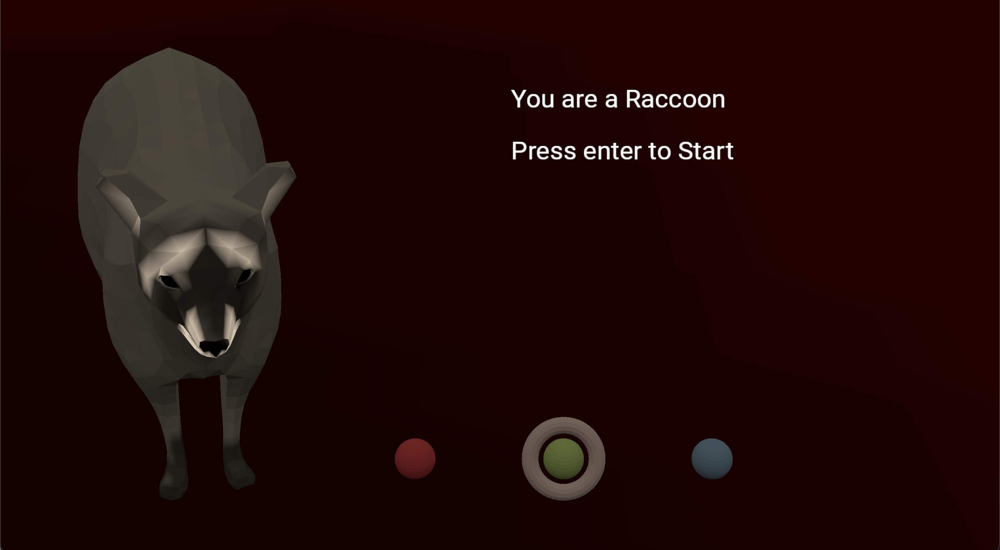

# Rags to Raccoon

Author: Sarah Di (sarahdi)

Design: My game is about a raccoon spending a day in New York.

Text Drawing: The main files used for Text Drawing are Font.cpp/Font.hpp and TextureProgram.cpp/hpp. The text for this game is precomputed and rendered at runtime using code adapted from Qiru Hu's Font.cpp/hpp (with permission!). Within Font.cpp/hpp there are two main functions that we use to process the text: gen_texture, which makes the texture based off of some string (this follows the logic found in https://learnopengl.com/In-Practice/Text-Rendering), and its helper function wrap_text, which tries to split lines based on a predetermined line_length but most of the time splits on the nearest whitespace delimiter to that line_length. Using the TextureProgram.cpp/hpp by Jim McCann which was covered in class, I then render the texture into the blender scene (with some additional clarification on texture rendering from Sasha's notes obtained via the class Discord.)

Choices: The game stores choices in Story.cpp/hpp. Since there are only three endings and no additional variables/inventory, I just hardcoded all the possible body text responses using a struct of string vectors.

Screen Shot:

How To Play:

You are a Raccoon and are really excited to spend a day in the Big Apple!
Use the left and right arrow keys to switch between options. Press return to enter a choice.

Sources: I made the blender scene, the music, and the script myself. I got the Roboto font from Google Fonts. I adapted the text drawing from a combination of Qiru Hu's Font.cpp/hpp and Jim McCann's TextureProgram.cpp/hpp.

This game was built with [NEST](NEST.md).

